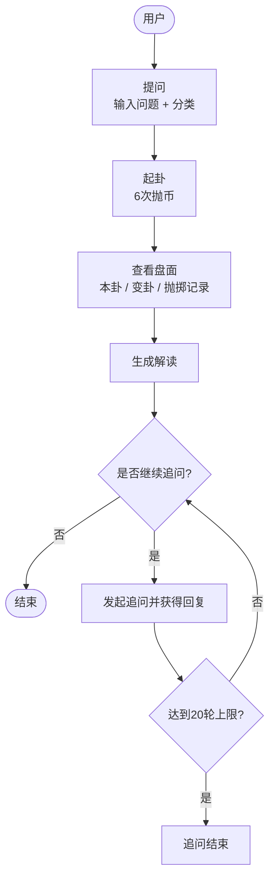
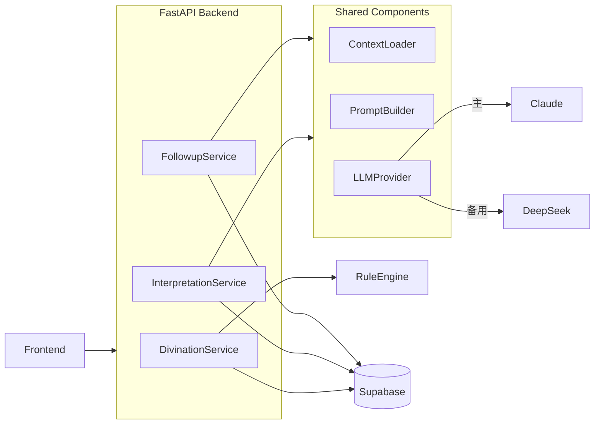
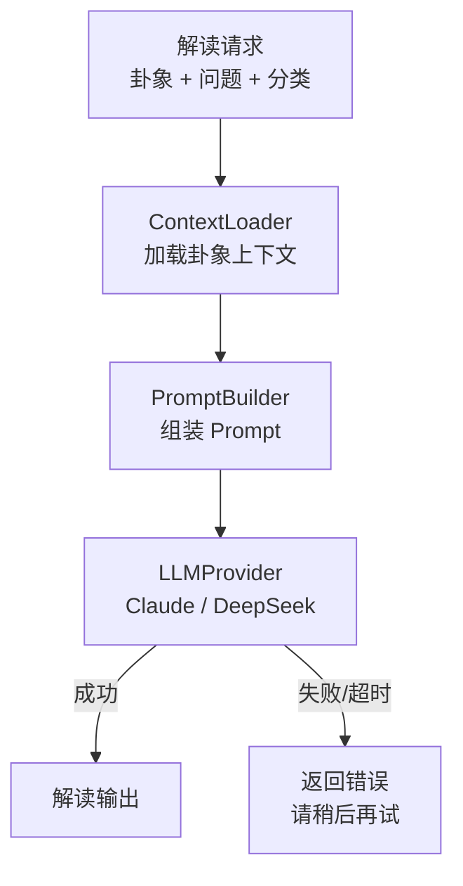

# 六爻网站 - Spec Design v1.1

> 文档定位：描述系统如何构建（架构决策、模块职责、接口契约、数据模型）。  
> 上游依赖：SPEC_REQUIREMENT.md（定义"做什么"）  
> 下游产出：SPEC_IMPLEMENTATION（代码、配置、部署脚本）

### 术语固定表

| 中文 | 英文 / 字段名 |
|------|--------------|
| 本卦 | `base_hexagram` |
| 变卦 | `changed_hexagram` |
| 追问 | Follow-up（技术上下文用 `followup`） |
| 起卦记录 | Divination |
| 单爻记录 | DivinationLine |
| 解读结果 | Interpretation |

---

## 目录

1. [系统架构概览](#1-系统架构概览)
   - 1.1 分层架构
   - 1.2 模块职责边界
2. [系统流程图](#2-系统流程图)
   - 2.1 图 A — 端到端用户流程
   - 2.2 图 B — 系统数据流
   - 2.3 图 C — 解读服务流程
3. [核心交互接口](#3-核心交互接口)
   - 3.1 接口分类
   - 3.2 关键接口设计决策
4. [核心数据实体](#4-核心数据实体)
   - 4.1 Divination
   - 4.2 DivinationLine
   - 4.3 Interpretation
   - 4.4 FollowupConversation
   - 4.5 FollowupMessage
   - 4.6 Hexagram
5. [关键设计决策](#5-关键设计决策)
   - 5.1 Rule Engine 与 Interpretation 解耦
   - 5.2 /result 与 /interpret 解耦
   - 5.3 Follow-up 独立为对话能力
   - 5.4 TemplateFallback 的适用边界
   - 5.5 上下文锚定原则
   - 5.6 MVP 的单一路径设计
6. [MVP 范围与后续扩展](#6-mvp-范围与后续扩展)
   - 6.1 MVP 范围
   - 6.2 后续扩展方向

---

## 1. 系统架构概览

### 1.1 分层架构

```
Frontend (Next.js)
  ↓ REST/JSON
FastAPI Backend
  │
  ├── DivinationService
  │     └── RuleEngine              ← 确定性纯函数，无 IO
  │           ├── CoinMapper
  │           └── HexagramGen
  │
  ├── InterpretationService         ← AI 解读，不可用时返回错误（MVP）
  │     └── (uses Shared Components)
  │
  ├── FollowupService               ← 追问对话，独立 Service
  │     ├── ConversationManager     ← 维护对话历史、20 轮计数
  │     └── (uses Shared Components)
  │
  ├── Shared Components
  │     ├── ContextLoader
  │     │     ├── loads HexagramContext   ← 供 InterpretationService 使用
  │     │     └── loads ChatContext       ← 供 FollowupService 使用（卦象 + 历史对话）
  │     ├── PromptBuilder
  │     ├── SafetyCheck             ← v2 可插拔护栏层
  │     └── LLMProvider
  │           ├── ClaudeProvider    ← 主 provider
  │           └── DeepSeekProvider  ← 备用 provider
  │
  └── Data Layer
        └── Supabase PostgreSQL
```

> **注**：TemplateFallback、SafetyCheck 及解读模式（classical / modern / strategic / emotional）为 v2 功能，MVP 阶段 LLM 不可用时直接返回错误提示。

---

### 1.2 模块职责边界

| 模块 | 职责 | 不应做 |
|------|------|-------|
| RuleEngine | 硬币→爻象映射、卦象生成（确定性纯函数） | 任何解读、AI 调用、IO 操作 |
| DivinationService | 编排起卦流程，调用 RuleEngine，持久化卦象数据 | 直接生成解读内容 |
| InterpretationService | 生成白话解读；LLM 不可用时返回错误提示 | 修改卦象数据 |
| FollowupService | 管理追问对话生命周期，委托 ConversationManager 维护历史和轮数限制 | 重新解读卦象、脱离卦象上下文回答 |
| ConversationManager | 存取对话历史、计数并强制 20 轮上限 | 生成回复内容 |
| ContextLoader | 按调用方加载 HexagramContext 或 ChatContext | 修改上下文数据 |
| PromptBuilder | 将 context 组装为 LLM system prompt + user message | 决定解读策略 |
| SafetyCheck | 过滤越界输入；校验输出是否锚定卦象上下文（v2） | 业务逻辑、数据持久化 |
| LLMProvider | 封装 Claude / DeepSeek API，统一接口，处理 provider 切换 | 业务逻辑、上下文构建 |
| Supabase PostgreSQL | 持久化所有业务数据 | 业务计算 |

---

## 2. 系统流程图

### 2.1 图 A — 端到端用户流程



### 2.2 图 B — 系统数据流



### 2.3 图 C — 解读服务流程



---

## 3. 核心交互接口

> 本节定义接口分类与设计意图，字段格式与请求 / 响应 Schema 见 SPEC_IMPLEMENTATION。

### 3.1 接口分类

| 分组 | 接口 | 说明 |
|------|------|------|
| 起卦流程 | `POST /divinations` | 创建起卦（含问题、分类） |
| | `POST /divinations/{id}/lines` | 提交单次抛币结果（第 1-6 爻） |
| | `GET /divinations/{id}/result` | 获取完整盘面（本卦、变卦、抛掷记录） |
| 解读 | `POST /divinations/{id}/interpret` | 触发 AI 解读，返回白话解读内容 |
| 追问 | `POST /divinations/{id}/followup` | 发起追问，返回 AI 回复 |
| | `GET /divinations/{id}/followup` | 获取追问历史 |
| 参考数据 | `GET /hexagrams/{id}` | 查询单卦基础信息 |
| P1 | `GET /divinations` | 获取历史起卦列表（需登录） |

### 3.2 关键接口设计决策

1. **/result 与 /interpret 解耦**：盘面数据（本卦、变卦）由 `/result` 即时返回；AI 解读由 `/interpret` 单独触发，失败不影响盘面展示。

2. **爻属性由服务端推导**：前端仅提交原始硬币面值，爻象类型（老阴 / 少阳等）、动爻标记均由后端 RuleEngine 计算，不由前端传入。

3. **追问绑定卦象**：`/followup` 路由挂载在 `/divinations/{id}` 下，确保追问始终与特定卦象上下文绑定。

---

## 4. 核心数据实体

> 本节描述各实体的语义与关键字段，建表 DDL 与索引设计见 SPEC_IMPLEMENTATION。

### 4.1 Divination（起卦记录）

| 字段 | 类型 | 说明 |
|------|------|------|
| id | UUID | 主键 |
| question | text | 用户问题 |
| category | enum | 感情 / 事业 / 财运 / 学业 / 合作 / 健康 / 寻物 / 其他 |
| timeframe | text | 可选，时间范围 |
| session_token | text | MVP 匿名标识；P1 替换为 user_id |
| base_hexagram | int | 本卦编号（1-64） |
| changed_hexagram | int | 变卦编号（1-64），无动爻时与本卦相同 |
| changing_lines | int[] | 动爻位置列表（如 `[2, 5]`） |
| created_at | timestamp | 创建时间 |

### 4.2 DivinationLine（单爻记录）

| 字段 | 类型 | 说明 |
|------|------|------|
| id | UUID | 主键 |
| divination_id | UUID | 外键 |
| line_number | int | 第几爻（1-6） |
| coin_values | int[] | 三枚硬币面值 |
| coin_sum | int | 总和（6 / 7 / 8 / 9） |
| line_type | enum | 老阴 / 少阳 / 少阴 / 老阳 |
| is_changing | bool | 是否为动爻 |

### 4.3 Interpretation（解读结果）

| 字段 | 类型 | 说明 |
|------|------|------|
| id | UUID | 主键 |
| divination_id | UUID | 外键，每次起卦一条（MVP） |
| language | varchar | 语言代码，默认 `zh-CN` |
| summary | text | 总结（3-5 句） |
| base_reading | text | 本卦解读 |
| changing_lines_analysis | text | 动爻分析（无动爻时为空） |
| changed_hexagram_trend | text | 变卦趋势（无动爻时为空） |
| category_advice | text | 分类建议 |
| action_advice | text[] | 行动建议（3 条） |
| generated_by | enum | 固定为 `ai`（MVP） |
| provider | varchar | 实际使用的 LLM provider，如 `claude` / `deepseek` |
| created_at | timestamp | 创建时间 |

### 4.4 FollowupConversation（追问对话）

| 字段 | 类型 | 说明 |
|------|------|------|
| id | UUID | 主键 |
| divination_id | UUID | 外键，与 Divination 1:1 |
| rounds_used | int | 已使用轮数 |
| rounds_limit | int | 上限，固定为 20 |
| created_at | timestamp | 创建时间 |

### 4.5 FollowupMessage（追问消息）

| 字段 | 类型 | 说明 |
|------|------|------|
| id | UUID | 主键 |
| conversation_id | UUID | 外键 |
| role | enum | `user` / `assistant` |
| content | text | 消息内容 |
| created_at | timestamp | 创建时间 |

### 4.6 Hexagram（卦象参考数据）

| 字段 | 类型 | 说明 |
|------|------|------|
| hexagram_id | int | 1-64 |
| name | varchar | 卦名，如"乾" |
| trigrams | varchar[] | 上下卦（八卦），如 `["乾","乾"]` |
| binary_code | varchar | 爻序二进制，如 `"111111"` |
| palace | varchar | 所属宫位（八宫） |
| world_line | int | 世爻位置（1-6） |
| response_line | int | 应爻位置（1-6） |
| fortune_level | int | 吉凶评级（1-5） |
| meaning | text | 传统卦义简述 |

---

## 5. 关键设计决策

> 本节记录架构层面的设计选择与依据，具体实现见 SPEC_IMPLEMENTATION。

### 5.1 Rule Engine 与 Interpretation 解耦

RuleEngine 只做确定性计算（硬币 → 爻 → 卦），不含任何解读逻辑。InterpretationService 读取已生成的卦象数据后独立调用 LLM 生成解读。

**好处**：RuleEngine 可完整单元测试；解读服务故障不影响起卦和盘面展示。

### 5.2 /result 与 /interpret 解耦

用户完成 6 次抛币后，盘面数据（本卦、变卦、原始记录）由 `/result` 即时返回，不依赖 LLM。AI 解读由 `/interpret` 单独触发。

**好处**：LLM 超时或故障时用户仍可看到盘面，解读区块单独展示错误状态。

### 5.3 Follow-up 独立为对话能力

FollowupService 作为独立 Service，通过 ConversationManager 维护追问历史与 20 轮计数，不复用 InterpretationService 的调用链。

**好处**：追问与首次解读的 prompt 策略可独立演进；对话状态管理集中在 ConversationManager，边界清晰。

### 5.4 TemplateFallback 的适用边界

MVP 阶段 LLM 不可用时直接返回错误提示，不实现模板兜底。v2 阶段如需提升可用性，仅在 InterpretationService 内引入 TemplateFallback，不影响其他模块。

### 5.5 上下文锚定原则

追问回复须锚定在本次卦象上下文中，通过两层机制保证（v2 补充第三层）：

1. **System Prompt**：PromptBuilder 将本卦、变卦、动爻信息注入每条追问的 system prompt
2. **Source Note**：每条 assistant 回复附注来源标注，如"以下回答基于本次卦象：本卦 × 变卦"
3. **SafetyCheck（v2）**：校验输出是否脱离卦象语境，作为可插拔护栏层后续引入

### 5.6 MVP 的单一路径设计

MVP 不实现多解读模式、多语言、缓存层。所有请求走单一路径，优先跑通核心流程，降低实现复杂度。

---

## 6. MVP 范围与后续扩展

### 6.1 MVP 范围

- 完整起卦流程（提问 → 6 次抛币 → 盘面展示）
- AI 白话解读（LLM 不可用时返回错误提示）
- 追问（Follow-up）最多 20 轮，与卦象绑定
- 匿名使用，无需登录
- 响应式布局（移动端 + 桌面端）
- 起卦进度持久化（中途刷新不丢失）

### 6.2 后续扩展方向

| 版本 | 功能 |
|------|------|
| v2 | TemplateFallback（InterpretationService 降级兜底） |
| | SafetyCheck（可插拔输入 / 输出校验层） |
| | 多解读模式（classical / modern / strategic / emotional） |
| | 历史记录页（需登录，JWT） |
| | 规则说明页（零基础入门引导） |
| v3 | 用户认证与账号体系 |
| | 国际化（zh-TW / zh-HK / en / ko） |
| | Prompt 缓存（降低 LLM 调用成本） |
| | VIP 功能（深度解读、专属模式） |

---

## 更新日志

- **v1.1** (2026-04-25)：重构文档结构，精简为 6 节；固定术语表；移除 Implementation 粒度内容（DDL、JSON Schema、代码片段、目录结构）至 SPEC_IMPLEMENTATION；架构简化为 MVP 单路径（移除 Redis、TemplateFallback；新增 DeepSeekProvider；SafetyCheck 标记为 v2）
- **v1.0** (2026-04-12)：初版 Design Spec
